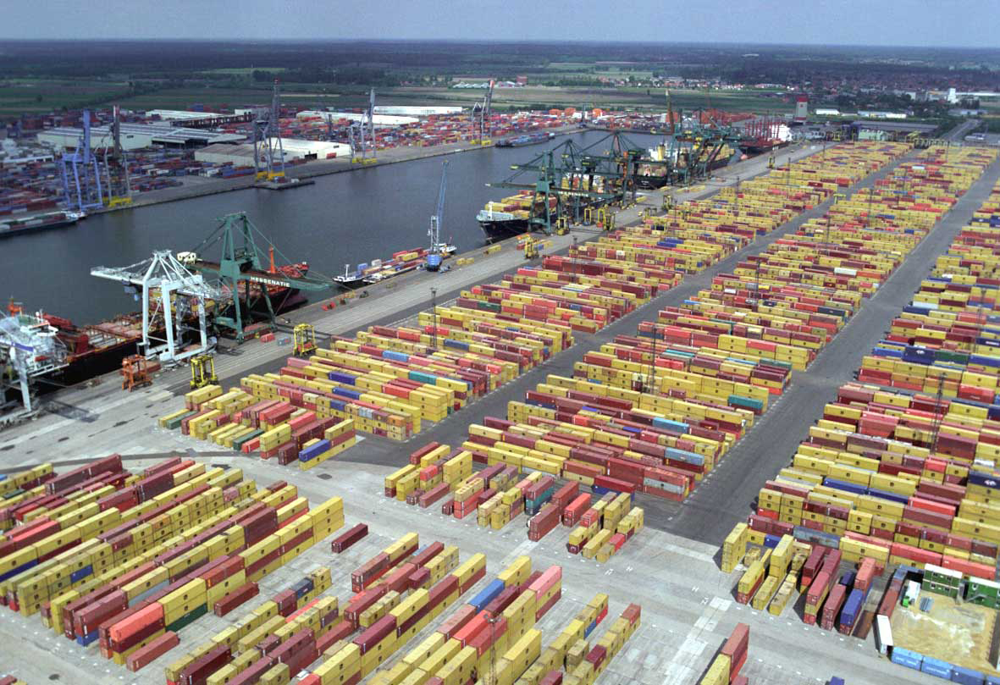

# Port Yard Visualizer & Management App

A planned full-stack web application designed to help a Yard Manager configure a physical container yard layout, track inventory placement, and view their terminal state in an interactive 3D grid.



---

## Project Purpose & Scope (In Development)

This project is a focused, full-stack application currently being built to master enterprise-grade development patterns with **Spring Boot** and **Angular**. Instead of tackling a massive multi-user system, this app will focus entirely on providing a single **Yard Manager** with an interactive visual control room.

### Core Features (Development Roadmap)
1. **Interactive Yard Configuration:** The manager will use a 2D drag-and-drop canvas to arrange and rotate blocks (Bays, Rows, Tiers) to mirror their physical port's unique layout.
2. **Dynamic 3D State Monitoring:** Using **Three.js**, the frontend will render a live 3D block environment showing stacked containers alongside clear, empty slot coordinate placeholders.
3. **Smart Placement Suggestions:** The system will leverage **Spring AI** to suggest the safest slot for an incoming container based on simple weights and logistics constraints (e.g., keeping heavy containers at the bottom of a stack).
4. **Real-Time Data Pipeline:** The app will combine **Apache Kafka** and **WebSockets** to update the 3D map instantly whenever container changes or simulated movements occur.

---

## Planned Tech Stack

The repository will be organized as a unified monorepo:

```text
PORT-YARD-MANAGEMENT-SYSTEM/
├── azure-infrastructure/       # Cloud Infrastructure via Terraform (AzureRM)
├── pym-backend-api/            # Spring Boot REST API & Event Processes
├── pym-frontend-ui/            # Angular (Three.js & Tailwind)
└── assets/                     # Documentation images and diagrams
```

### Technology Highlights
* **Backend:** Java 21, Spring Boot 4.1, Spring Data JPA, Spring AI, Apache Kafka, WebSockets.
* **Frontend:** Angular, TypeScript, Three.js (3D Grid Rendering), Angular CDK Drag & Drop, TailwindCSS.
* **Database & DevOps:** PostgreSQL, Docker Compose, Microsoft Azure.

---

## Planned Simulation Control Panel

To make the application interactive without needing real port hardware or a multi-user workforce, the dashboard will include an embedded **Simulation Panel**. Clicking simulation triggers will generate real-time data streams:
* **Simulate Deliveries:** Will automatically fire random container arrivals to test the Spring AI placement logic and verify that boxes update live on the 3D map via WebSockets.
* **Simulate Crane Activity:** Will use background timers to simulate physical crane travel delays, showing containers gliding into their slots in real-time.
